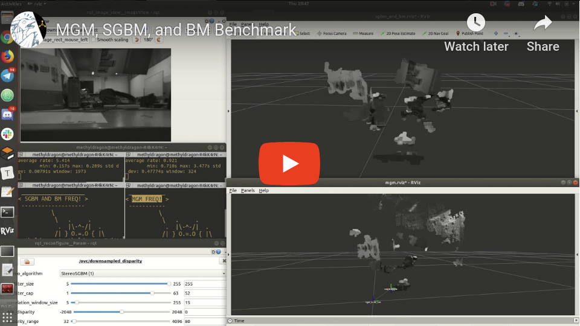
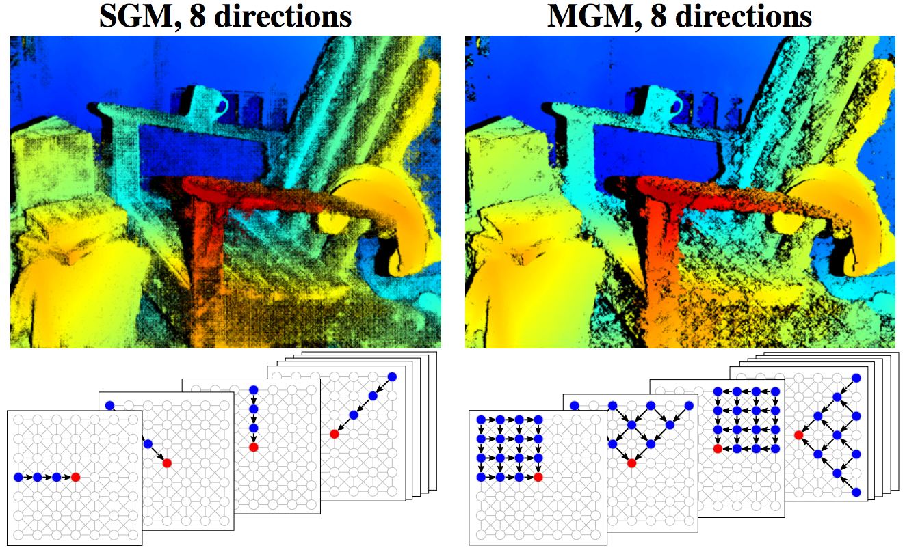

# mgm_ros

Author: methylDragon

ROS Nodelet package for doing disparity stereo-matching with the More Global Matching (MGM) algorithm!


## Demonstration

[](<https://www.youtube.com/watch?v=Gz7ItewldX8>)


## Introduction



[Image Source](<http://dev.ipol.im/~facciolo/mgm/>)


MGM is meant to be an improvement over the standard Semi-Global Matching (SGM) algorithm used by the `stereo_image_proc` algorithm. The paper and code that implements it reports better generated disparity images with little additional overhead.

This package wraps the functionality as a ROS nodelet that takes in rectified images, and can be used to generate point clouds.


## Features

The nodelet:

- Is implemented as a nodelet!
- Has dynamically reconfigurable parameters

Additionally, MGM does not actually require camera parameters, just rectified images. But this ROS nodelet requires some level of message synchronisation between rectified images and camera information.


## Setup

This package depends on the ROS wrapped mgm library found [here](<https://github.com/methylDragon/mgm/tree/multiscale>).

(I'm linking the fork of the original code because the branch has yet to be merged into the original repository.)


Run these commands in the root directory of a ROS workspace of your choice

```shell
cd src
git clone https://github.com/methylDragon/mgm.git
git clone https://github.com/methylDragon/mgm_ros.git

cd mgm
git checkout multiscale
cd ..

catkin build # Or you can use catkin_make
```


## Usage

Make sure you run this AFTER you have valid streams of stereo-camera images and camera info.

Simply use the included launch file!

You might need to do some remaps. The original topic entry points are:

- `left/image_raw` and `right/image_raw`
- `left/camera_info` and `right/camera_info`

Outputs are:

- `left/downsampled/image_rect` and `right/downsampled/image_rect`
- `downsampled/disparity`
- `downsampled/points`

```shell
# Run the launchfile!
$ roslaunch mgm_ros mgm_ros.launch

# You can visualise them with rviz!
$ rviz

# Just make sure that you configure rviz to use an appropriate fixed frame
# As well as a relevant topic visualiser!
```

You may want to reconfigure the nodelet dynamically as well!

```shell
$ rosrun rqt_reconfigure rqt_reconfigure
```


Alternatively, you may use the nodelet in your own launch files.

```xml
<!-- Managed -->
<node pkg="nodelet" type="nodelet" name="downsampled_disparity_mgm" args="load mgm_ros/mgm point_manager" output="screen">
    <remap from="left/image_rect" to="left/downsampled/image_rect"/>
    <remap from="right/image_rect" to="right/downsampled/image_rect"/>
    <remap from="left/camera_info" to="left/downsampled/camera_info"/>
    <remap from="right/camera_info" to="right/downsampled/camera_info"/>

    <remap from="disparity" to="downsampled/disparity"/>
</node>

<!-- Standalone -->
<node pkg="nodelet" type="nodelet" name="downsampled_disparity_mgm" args="standalone mgm_ros/mgm" output="screen">
    <remap from="left/image_rect" to="left/downsampled/image_rect"/>
    <remap from="right/image_rect" to="right/downsampled/image_rect"/>
    <remap from="left/camera_info" to="left/downsampled/camera_info"/>
    <remap from="right/camera_info" to="right/downsampled/camera_info"/>

    <remap from="disparity" to="downsampled/disparity"/>
</node>
```


## Limitations and Caveats

It is suspected that due to SGBM and BM's inclusion into OpenCV, that there have been additional optimisations that lead SGBM and BM to be much, much faster than MGM (about 30x faster.)

Because of this, the MGM demo runs at a much slower rate, and sometimes might not even produce any point clouds at all if incoming camera info messages are not throttled. (This is possibly due to strict synchronisation requirements in the `stereo_image_proc` nodelet responsible for converting disparity messages to point clouds.)

Additionally, due to this issue, it is important to ensure that the MGM disparity nodelet (and possibly the disparity to point cloud conversion nodelet) are running in **separate processes**. Otherwise there might be issues with topic subscriptions.

**Pull requests and improvements will be greatly appreciated with regards to these!**

- For ROS improvements, kindly **send a PR to this repo**.

- For MGM related improvements, **send a PR to the [original repo](<https://github.com/gfacciol/mgm>)**.


## Credits

This ROS package leverages the [More Global Matching (MGM) stereo matching algorithm](<http://dev.ipol.im/~facciolo/mgm/>) by G. Facciolo, C. de Franchis, and E. Meinhardt

```
G. Facciolo and C. de Franchis and E. Meinhardt,
"MGM: A Significantly More Global Matching for Stereovision",
in British Machine Vision Conference, BMVC 2015.

Site : http://dev.ipol.im/~facciolo/mgm/
Email: gabriele.facciolo@cmla.ens-cachan.fr
```

It uses the [implementation](<https://github.com/gfacciol/mgm>) as a library.

The actual ROS nodelet is written by methylDragon, but is based off of the nodelets in the `stereo_image_proc` package.